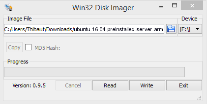

# Kubernetes on Raspberry Pi

[Build Reference](https://wiki.learnlinux.tv/index.php/Setting_up_a_Raspberry_Pi_Kubernetes_Cluster_with_Ubuntu_20.04)

[Reference 2](https://medium.com/icetek/building-a-kubernetes-cluster-on-raspberry-pi-running-ubuntu-server-8fc4edb30963)

## Overview

| Pi | IP |
| --- | --- |
| pi-1 | 192.168.86.36 | 
| pi-2 | 192.168.86.45 |
| pi-3 | 192.168.86.43 |
| pi-4 | 192.168.86.46 |

## Set-up Process (do the following on each Raspberry Pi)

* [Download and flash Pi SD card](https://ubuntu.com/download/raspberry-pi)
* [Download Win32 Disk Imager](https://sourceforge.net/projects/win32diskimager/files/latest/download?source=navbar)

* Flash SD Card




Use ```ubuntu``` for the username and the password.

You will be asked to change this default password after you log in.

## SSH Key
Generate the key:
```
ssh-keygen -t rsa -b 4096 -f ~/.ssh/rpi -P ""
```

and add it to ssh key agent:
```
ssh-add ~/.ssh/rpi
```

Log into Pi
```
ssh ubuntu@192.168.0.238
```

Let’s log out and copy the SSH keys, so we won’t have to use the password for every login — also for k3sup to be able to deploy the Kubernetes cluster. To copy the SSH keys to the machine run the following
```
ssh-copy-id -i .ssh/rpi ubuntu@192.168.0.238
```


* Edit the host name

Edit /etc/hosts and /etc/hostname on the SD card to the actual name of the instance
```
sudo nano /etc/hostname
```

Change that hostname, open and edit the necessary file and save.

Next open the hosts file with the command 
```
sudo nano /etc/hosts
```
Where you see your old hostname (i.e. localhost), change it to the new name. Save and close that file. Now, reboot your machine.

For example:
```
 k8s-master

 k8s-worker-01
```
(Or whatever naming scheme you wish)

* In Windows, edit the hosts file to point to your PI IP addresses:
Path `C:\Windows\System32\drivers\etc\hosts`

* Configure boot options

Edit /boot/firmware/cmdline.txt and add:
```
cgroup_enable=cpuset cgroup_enable=memory cgroup_memory=1 swapaccount=1
```

Note: Add that to the end of the first line, do not create a new line.

* Install all updates

```
 sudo apt update && sudo apt dist-upgrade
 ```
 
 * Reboot

Reboot each Pi:

```
 sudo reboot
```

* Create a user for yourself
```
 sudo adduser jay
 usermod -aG sudo jay
```

* Install Docker

```
 curl -sSL get.docker.com | sh
 sudo usermod -aG docker jay
```

* Set Docker daemon options

Edit the daemon.json file (this file most likely won't exist yet)

```
 sudo nano /etc/docker/daemon.json
 ```

 ```
 {
   "exec-opts": ["native.cgroupdriver=systemd"],
   "log-driver": "json-file",
   "log-opts": {
     "max-size": "100m"
   },
   "storage-driver": "overlay2"
 }
```

* Enable routing

Find the following line in the file: `/etc/sysctl.conf`

```
 #net.ipv4.ip_forward=1
```

Uncomment that line.

* Reboot again
```
 sudo reboot
```

* Test that docker is working properly

Check docker daemon:
```
 systemctl status docker
```

Run the hello-world container:
```
 docker run hello-world
```

* Add Kubernetes repository
```
 sudo nano /etc/apt/sources.list.d/kubernetes.list
```
Add:
```
 deb http://apt.kubernetes.io/ kubernetes-xenial main
```

Add the GPG key to the Pi:
```
 curl -s https://packages.cloud.google.com/apt/doc/apt-key.gpg | sudo apt-key add -
```

* Install required Kubernetes packages
```
 sudo apt update

 sudo snap install kubeadm --classic

 sudo snap install kubectl --classic

 sudo snap install kubelet --classic
```

Note: If you get errors with the first command, wait a few minutes and try again.

* Master-only - Initialize Kubernetes

Run:
```
 sudo kubeadm init --pod-network-cidr=10.244.0.0/16
```

Once this runs, you will get some output that will include the join command, but don't join nodes yet. Copy this somewhere for later.

* Set up config directory

The previous command will give you three additional commands to run, most likely these:

```
 mkdir -p ~.kube
 sudo cp /etc/kubernetes/admin.conf ~/.kube/config
 sudo chown $(id -u):$(id -g) $HOME/.kube/config
```
Go ahead and run those, but if it recommends different commands, run those instead.

* Install flannel network driver
```
 kubectl apply -f https://raw.githubusercontent.com/coreos/flannel/master/Documentation/kube-flannel.yml
 ```

Note: The lack of sudo is intentional

* Make sure all the pods come up
```
kubectl get pods --all-namespaces
```

* Join worker nodes to the cluster

Once all of the pods have come up, run the join command on each worker node. This command was provided in an earlier step.

* Check status of nodes

See if the nodes have joined successfully, run the following command a few times until everything is ready:
```
 kubectl get nodes
```

* pod.yml
```
 apiVersion: v1
 kind: Pod
 metadata:
   name: nginx-example
   labels:
     app: nginx
 spec:
   containers:
     - name: nginx
       image: linuxserver/nginx
       ports:
         - containerPort: 80
           name: "nginx-http"
```

* service-nodeport.yml
```
 apiVersion: v1
 kind: Service
 metadata:
   name: nginx-example
 spec:
   type: NodePort
   ports:
     - name: http
       port: 80
       nodePort: 30080
       targetPort: nginx-http
   selector:
     app: nginx
```

* Apply the pod yaml file
```
 kubectl apply -f pod.yml
```
Check the status with:
```
 kubectl get pods
```
Check the status with more info:
```
 kubectl get pods -o wide
```

* Apply the service yaml file
```
 kubectl apply -f service-nodeport.yml
```

Check the status with:
```
 kubectl get service
 ```
